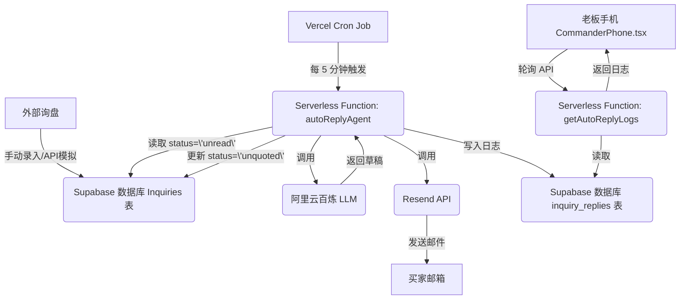

# RealSourcing Commander — 8 天冲刺开发方案（V3.0）

> **目标**：在 3 月 12 日前，完成"第一台封装好的老板手机"的 MVP 交付，核心故事是"AI 自动回复询盘"。
> 
> **核心约束**：单人开发，时间紧迫，必须依赖成熟的托管服务，规避一切不必要的工程复杂度。

---

## 1. 最终交付物：一个能打动人的故事

3 月 12 日，你需要向你的潜在客户或投资人展示的，不是一个功能齐全的 App，而是一个**能证明 AI 价值的、令人信服的故事**。

这个故事的核心场景是：

1.  **新询盘到达**：你的 Commander 手机收到一条来自"阿里国际站"的新询盘通知。
2.  **AI 自动分析**：点开询盘，AI 已经自动分析了买家意图、提取了关键信息，并给出了"高意向"的标签。
3.  **AI 自动回复**：几分钟后，系统自动用你的口吻、你的风格，给买家发送了一封专业的首次回复邮件。
4.  **老板全程可见**：在手机的"AI 工作日志"里，你能清楚地看到 AI 刚刚帮你完成了哪些工作，回复了哪些客户。

这个故事的每一环，都必须是**真实发生**的，而不是 Mock 数据。

## 2. 技术实现路径：用成熟服务搭积木

为了在 8 天内实现这个故事，我们必须放弃自建任何基础设施，彻底拥抱 Serverless 和成熟的 PaaS/SaaS 服务。

| 需求 | 技术选型 | 理由 |
| :--- | :--- | :--- |
| **代码托管 & 部署** | **Vercel Hobby 套餐** | 免费，与 Next.js/Hono 无缝集成，CI/CD 自动化，全球 CDN |
| **数据库** | **Supabase Free Tier** | 免费，提供 PostgreSQL 数据库，自带认证、存储和 API |
| **定时任务** | **Vercel Cron Jobs** | 免费，无需管理服务器，`cron` 表达式配置，与 Serverless Function 完美结合 |
| **邮件发送** | **Resend Free Plan** | 免费，每月 3000 封，API 极简，无需配置 SMTP |
| **AI 模型** | **阿里云百炼（已有）** | 沿用现有 `services/ai.ts`，无需改动 |

**数据流设计**：

## 3. 8 天冲刺计划：每日核心任务

| 日期 | 核心任务 | 产出物 |
| :--- | :--- | :--- |
| **Day 1 (3/5)** | **环境搭建**：注册 Vercel, Supabase, Resend 账号，获取 API Keys。 | `.env` 文件中的所有 API Key |
| **Day 2 (3/6)** | **数据库迁移**：将现有的 SQLite `schema.sql` 导入 Supabase。 | 一个包含所有表的 Supabase 项目 |
| **Day 3 (3/7)** | **后端部署**：将 Hono 后端改造为 Vercel Serverless Function，并成功部署。 | 一个可公网访问的后端 API 地址 |
| **Day 4 (3/8)** | **核心逻辑实现**：完成 `autoReplyAgent` 函数，本地测试通过。 | `services/followup.ts` 和 `services/emailService.ts` |
| **Day 5 (3/9)** | **定时任务部署**：将 `autoReplyAgent` 注册为 Vercel Cron Job，线上测试。 | Vercel Cron Job 成功执行的日志 |
| **Day 6 (3/10)**| **前端改造**：完成 `AutoReplyLog.tsx` 组件，并在 `CommanderPhone.tsx` 中集成。 | 前端页面能展示 AI 工作日志 |
| **Day 7 (3/11)**| **联调与测试**：前后端完整流程联调，手动在 Supabase 中插入新询盘，观察整个自动化流程。 | 一个完整的、可演示的端到端流程 |
| **Day 8 (3/12)**| **打包与交付**：将前端打包成 PWA 或使用原生壳套用，安装到手机上，准备演示。 | "第一台封装好的老板手机" |

## 4. 风险与预案

- **风险**：数据库迁移遇到不兼容问题。
- **预案**：放弃迁移，只在 Supabase 中创建 `inquiries` 和 `inquiry_replies` 两张核心表，保证 MVP 故事能跑通。

- **风险**：Resend 域名验证耗时过长。
- **预案**：使用 Resend 提供的默认测试域名（如 `on.resend.com`）发送，虽然看起来不专业，但能保证功能可用。

- **风险**：前端展示效果不佳。
- **预案**：放弃实时轮询，改为手动下拉刷新，简化前端逻辑，优先保证核心功能稳定。

---

**结论**：这个方案是高度务实且可行的。它放弃了所有不切实际的幻想，将全部精力聚焦在 8 天内讲好一个核心故事上。**今天最重要的事，就是去注册那三个平台的账号，拿到 API Key。**
